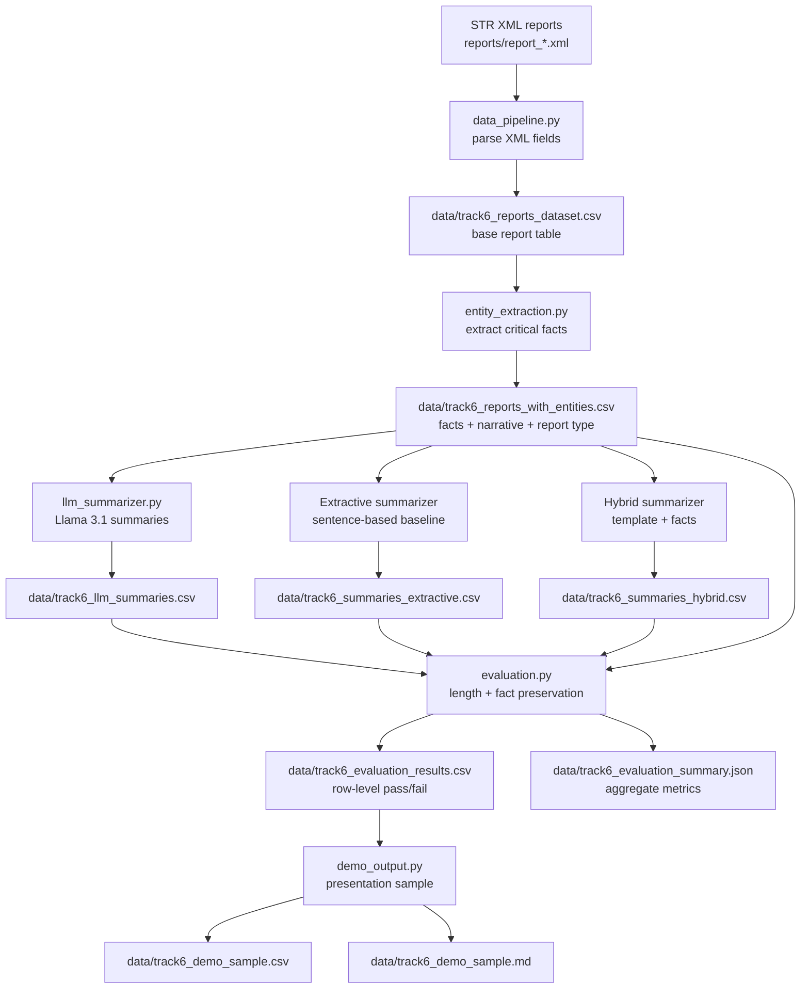

# Track 6 Pipeline Workflow



## Stage Summary

| Stage | Script | Input | Output | Purpose |
|---|---|---|---|---|
| 1. Data parsing | `data_pipeline.py` | `reports/report_*.xml` | `data/track6_reports_dataset.csv` | Convert XML STR reports into a flat table. |
| 2. Entity extraction | `entity_extraction.py` | `track6_reports_dataset.csv` | `track6_reports_with_entities.csv` | Extract customer, counterparty, banks, amount, date, mode, countries, account numbers. |
| 3. Summarization | `llm_summarizer.py` | `track6_reports_with_entities.csv` | `track6_llm_summaries.csv` | Generate 100-200 word analyst-facing summaries. |
| 4. Evaluation | `evaluation.py` | summaries + entity dataset | `track6_evaluation_results.csv`, `track6_evaluation_summary.json` | Check word count and factual faithfulness. |
| 5. Demo output | `demo_output.py` | `track6_evaluation_results.csv` | `track6_demo_sample.csv`, `track6_demo_sample.md` | Build final presentation-ready examples. |

## Main Commands

```bash
python data_pipeline.py
python entity_extraction.py
python llm_summarizer.py --limit 5 --overwrite
python evaluation.py
python demo_output.py --sample-size 10
```

For larger runs:

```bash
python llm_summarizer.py --all --resume --batch-size 25
python evaluation.py
python demo_output.py --sample-size 10
```

## Validation Logic

The evaluation stage checks:

- summary length is 100-200 words
- customer is preserved
- counterparty is preserved
- bank/institution names are preserved
- amount is preserved, allowing comma formatting differences
- date is preserved
- transaction mode is preserved
- account numbers are preserved

The final demo output shows:

- original narrative
- extracted facts
- generated summary
- validation result
- pass/fail explanation
